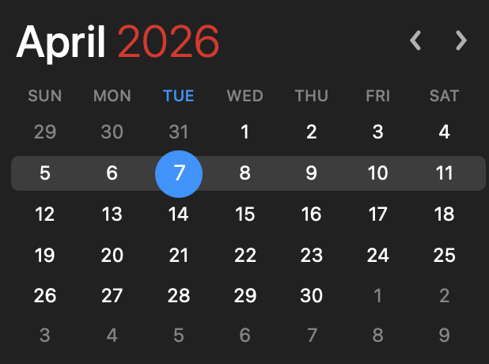

# Light Calendar

A lightweight macOS menu bar calendar app built with Electron. Click the tray icon to view a clean, dark-themed calendar — one click away from any workflow.



## Features

- **Menu bar native** — lives in the macOS tray, no Dock icon
- **Dark theme** — matches macOS dark mode aesthetics
- **Today at a glance** — current date highlighted with a blue circle, current week row subtly emphasized
- **Month navigation** — browse months with ‹ / › arrows
- **Quick return** — click the month/year header to jump back to today
- **Click to select** — tap any date to highlight it
- **Easy exit** — right-click the tray icon and choose **Quit Light Calendar**
- **Auto-refresh** — today's highlight updates automatically at midnight

## Getting Started

### Prerequisites

- [Node.js](https://nodejs.org/) (v18+)

### Install

```bash
npm install
```

### Run

```bash
npm start
```

### Dev Mode

Opens DevTools and disables blur-to-dismiss so you can inspect the UI:

```bash
npm run dev
```

## Project Structure

```
light-calendar-app/
├── main.js          # Electron main process (tray + window)
├── index.html       # Calendar markup
├── renderer.js      # Calendar rendering logic
├── styles.css       # Dark theme styles
├── assets/
│   └── tray-icon*   # macOS Template tray icons (1x + 2x)
└── package.json
```

## How It Works

The app uses Electron's native `Tray` API to place a calendar icon in the macOS menu bar. Left-clicking it toggles a frameless, transparent `BrowserWindow` positioned directly below the icon, and right-clicking opens a small menu with a **Quit** option. The calendar is rendered with vanilla JS — no framework needed for this scope.

## License

ISC
